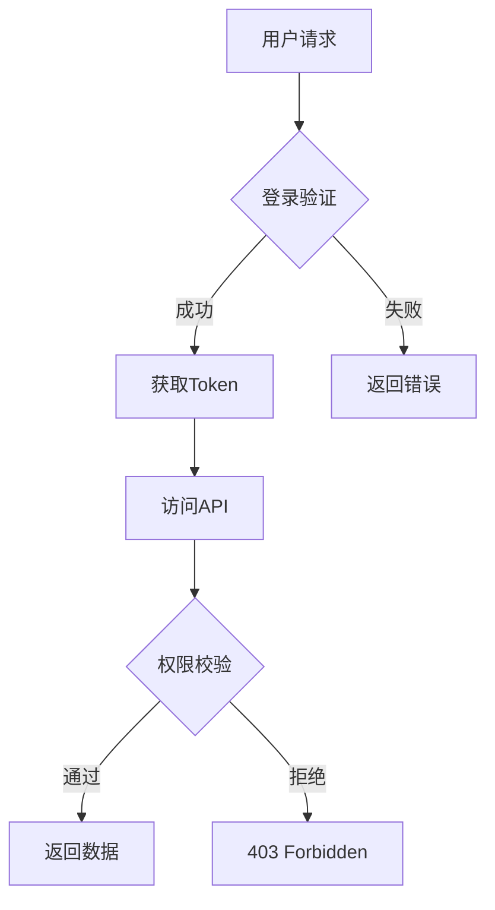

# 📚 知识卡片 2026-04-20

> 阅读时长：约60分钟

---

## 📰 一、科技热点

### 1. 人形机器人半马开跑！北京荣耀"闪电"夺冠

**事件**：2026年4月19日，北京亦庄第二届人形机器人半程马拉松鸣枪开跑！

**震撼数据**：
- 荣耀"闪电"机器人以**50分26秒**完赛，超越人类男子半马世界纪录（57分20秒）
- 100+支队伍、300+台机器人参赛
- 近四成采用自主导航技术
- 上海国地飞跃队实现**10秒换电**（无需重启机器人）

**意义**：标志我国人形机器人运动能力达到全球顶尖水平，机器人正式从实验室走向街头！

---

### 2. DeepSeek终于"下海"！估值100亿美元

**重磅消息**：一直坚持"不差钱"的DeepSeek，终于开始接受外部投资了！

**关键信息**：
- 目标估值：**不低于100亿美元**
- 募集规模：不少于3亿美元
- 国资圈哀嚎"根本投不进去"
- 梁文锋战略：用开源模型当底座，靠差异化服务变现

**点评**：这波操作把"理想主义"和"现实主义"玩明白了！

---

### 3. 华为放大招！Pura X Max折叠屏发布

**今日发布**：
- 华为Pura X Max：横向阔折叠设计，展开就是小平板
- 代言人：姚安娜（任正非女儿亲自下场）
- WATCH FIT 5系列智能手表同步发布
  - 轻薄环保标准版
  - 旗舰材质Pro版

---

### 4. AI开始审论文了！AAAI 2026单日处理2万篇

**学术圈变革**：
- AAAI 2026首次实装AI论文审稿
- 单日可处理**2万篇**
- 单篇成本**不到1美元**
- 效率提升几十倍

**点评**：1美元审一篇论文，这价格连奶茶都买不到啊……

---

### 5. 光芯片成AI新战场

**行业动态**：
- GPU不够用，光互连技术（硅光芯片、光子芯片）成为新宠
- 用光子代替电子：带宽更高、功耗更低
- 中信建投喊出"持续推荐光通信产业链"
- 未来五年预计起飞

---

### 6. 全球AI投资飙到5810亿美元

**投资热潮**：
- 具身智能（人形机器人）成为新风口
- 百亿级融资频现
- 智元机器人、宇树科技、地瓜机器人等密集融资、建厂、量产

**一句话总结**：资本用真金白银投票，下一个爆点就是能跑能跳能干活的人形机器人！

---

## 💰 二、商业风向

### 2026年程序员副业进阶指南

#### 核心结论

> **短期靠卖时间活下来，长期一定要向卖资产迁移。**

接单、咨询是用时间换钱，天花板是你每天只有24小时。而SaaS、课程、开源项目、量化策略，都是一次投入、持续产出的资产。

---

### 五条高阶副业路径

| 方向 | 启动难度 | 收益潜力 | 被动收入 |
|-----|---------|---------|---------|
| SaaS工具 | ⭐⭐⭐⭐ | ⭐⭐⭐⭐⭐ | 高 |
| 技术咨询 | ⭐⭐⭐ | ⭐⭐⭐⭐ | 低 |
| 开源商业化 | ⭐⭐⭐⭐ | ⭐⭐⭐⭐ | 中 |
| 知识付费 | ⭐⭐ | ⭐⭐⭐ | 中 |
| 量化交易 | ⭐⭐⭐⭐⭐ | ⭐⭐⭐⭐⭐ | 高 |

---

### 路径详解

#### 1. SaaS工具——把代码变成"印钞机"

**什么是SaaS副业？**
开发一个小型软件工具，以订阅制或买断制卖给用户。写一次代码，可以卖给无数人。

**适合方向**：
- 开发者工具（API调试、代码生成）
- 电商工具（订单管理、数据导出）
- 内容创作工具（封面生成、排期管理）
- 企业内部工具（考勤统计、报销审批）

**真实案例**：
- 国外：BuiltWith（技术栈检测工具），单人维护，年收入千万美元
- 国内：JSON格式化在线工具，月入3万+

**启动建议**：不要一上来就想做大平台。找一个你每天工作中重复操作的痛点，写一个小工具解决它。**MVP 1-2周即可上线！**

---

#### 2. 技术咨询——用经验换钱

**服务类型**：

| 服务 | 定价 | 典型场景 |
|-----|------|---------|
| 架构评审 | 按次/按小时 | 创业公司技术选型 |
| 代码审查 | 按代码量 | 团队代码质量提升 |
| 技术面试辅导 | 按小时 | 求职者模拟面试 |
| 性能优化诊断 | 按项目 | 线上系统卡顿排查 |

**为什么有机会？**
大厂资深工程师时薪很高，中小企业请不起全职，但偶尔需要专家看一眼。这就是你的机会！

**定价参考**：
- 3-5年经验：200-500元/小时
- 5-8年经验：500-1000元/小时
- 8年以上：1000-2000元/小时

---

#### 3. 开源项目商业化

**变现路径**：
1. 开源吸引流量（GitHub Stars）
2. 商业授权变现（企业版收费）
3. 插件/周边服务

**真实案例**：
开发者开源Python CRUD代码生成器 → GitHub Star 8000+ → 捐赠月入2000+ → 企业授权1999元/年 → 插件售卖99元/份 → **年入12万+**

---

#### 4. 知识付费

**适合方向**：
- 付费专栏（CSDN、掘金）
- 知识星球
- 技术课程（录屏/直播）

**降维打击策略**：
> 把复杂的概念"说人话"。用生活化的例子、生动的比喻，去解释晦涩的技术原理。

**案例**：
写一篇《用"抢超市"的故事理解线程安全》→ 通俗易懂 → 阅读量破万 → 广告分成+商单

---

#### 5. AI工具变现（2026年增长最快）

**具体方式**：
- 用Coze搭建AI智能体：单个报酬500-2000元
- 用AI批量生成短视频素材：单条50-200元
- 用AI工具做电商产品图：单张30-100元

**收益实测**：月均接3-5单，月收入**5000-15000元**

---

### 避坑指南（血泪经验）

1. **需求不清，坚决不接！** 如果客户只有一句话"帮我做个像微信一样的App"，赶紧跑。
2. **定金不到，绝不开工！** 坚持"3-4-3"或"5-3-2"付款节点。
3. **沟通留痕，谨防扯皮！** 所有需求变更都要在平台聊天记录里留证据。
4. **走平台交易，不要私转！** 平台的价值不是流量，而是兜底。
5. **别高估自己的时间！** 报价时一定要算上沟通、修改、测试、售后维护的时间。

---

## 🔤 三、程序员英语

### 项目答辩常用表达

#### 项目概述

```
I've been working on [项目名称] for [时间段].
这个项目是一个[一句话描述]，主要用于[核心价值]。

The main goal of this project is to [目标].
核心技术栈包括[技术列表]。

Key features:
- Feature 1: [描述]
- Feature 2: [描述]
- Feature 3: [描述]
```

#### 技术难点

```
One of the biggest challenges was [难点描述].
我们遇到的最大挑战是...

The solution I came up with was [解决方案].
我想到的解决方案是...

I implemented this using [技术/框架].
我使用[技术]实现了这个功能。

Performance improved by [X]% after optimization.
优化后性能提升了X%。
```

#### 架构设计

```
The system architecture follows a [架构模式] design.
系统架构遵循[架构模式]设计。

Let me walk you through the flow:
- User [操作] → [处理] → [返回]
让我来介绍一下流程：

The key components are:
1. [组件1]: 负责[功能]
2. [组件2]: 负责[功能]
3. [组件3]: 负责[功能]
```

#### 成果展示

```
As a result, we achieved [量化成果].
最终我们实现了[量化成果]。

User satisfaction increased by [X]%.
用户满意度提升了X%。

This project has been deployed to [环境] with [数据].
项目已部署到[环境]，服务[X]用户。
```

#### 常用过渡语

```
Moving on to the next point...
接下来讲下一个点...

Building on that...
在此基础上...

The key takeaway here is...
关键点是...

To summarize...
总结一下...
```

---

## 💻 四、每日知识（重点）

# 项目答辩画图技巧：让你的演示脱颖而出

> 本章节专为技术答辩、项目汇报场景设计，讲解如何用图表清晰呈现技术方案和项目成果。

## 4.1 画图的核心原则

### 4.1.1 为什么画图很重要？

1. **一图胜千言**：复杂的技术方案，口头讲解10分钟，不如一张清晰的架构图
2. **降低理解成本**：评审/面试官通常很忙，图可以帮助他们快速抓住重点
3. **展现专业度**：好的图能体现工程师的系统思维和表达能力

### 4.1.2 画图的四大原则

| 原则 | 说明 | 示例 |
|-----|------|-----|
| **简洁** | 只展示必要元素 | 架构图不要画太多节点 |
| **清晰** | 层次分明，职责明确 | 用不同颜色区分不同模块 |
| **准确** | 准确反映技术方案 | 不要为了好看而牺牲准确性 |
| **一致** | 风格统一，规范一致 | 整个PPT用同一套图标风格 |

---

## 4.2 常用图表类型及适用场景

### 4.2.1 架构图

**适用场景**：系统设计、模块划分、技术选型汇报

**画法要点**：
- 从上到下或从左到右，遵循阅读习惯
- 用方框表示服务/模块，用箭头表示调用关系
- 不同层级用不同颜色或背景区分
- 标注关键技术选型（如Redis、MySQL、Kafka）

**示例结构**：

```
┌─────────────────────────────────────────────────────────────┐
│                        用户层 (User Layer)                   │
│   [Web端]          [移动端]          [小程序]               │
└─────────────────────────────────────────────────────────────┘
                              │
                              ▼
┌─────────────────────────────────────────────────────────────┐
│                      网关层 (Gateway Layer)                  │
│                  [Spring Cloud Gateway]                      │
│              限流 / 鉴权 / 路由 / 协议转换                    │
└─────────────────────────────────────────────────────────────┘
                              │
              ┌───────────────┼───────────────┐
              ▼               ▼               ▼
┌─────────────────┐ ┌─────────────────┐ ┌─────────────────┐
│   业务服务A      │ │   业务服务B      │ │   业务服务C      │
│  (User Service)  │ │ (Order Service) │ │ (Product Svc)   │
│                  │ │                 │ │                 │
│  Spring Boot    │ │   Spring Boot   │ │   Spring Boot   │
│  MyBatis        │ │   JPA          │ │   MyBatis       │
└─────────────────┘ └─────────────────┘ └─────────────────┘
              │               │               │
              └───────────────┼───────────────┘
                              ▼
┌─────────────────────────────────────────────────────────────┐
│                       数据层 (Data Layer)                    │
│  [MySQL]        [Redis]         [Elasticsearch]            │
│   主库          缓存/会话       搜索                        │
└─────────────────────────────────────────────────────────────┘
```

### 4.2.2 时序图（Sequence Diagram）

**适用场景**：接口设计、流程讲解、问题复盘

**画法要点**：
- 左侧是发起方，右侧是响应方
- 纵向表示时间流逝
- 用箭头+文字说明每一步操作
- 异步操作用虚线箭头

**示例（用户下单流程）**：

```
┌──────┐     ┌──────────┐     ┌──────────┐     ┌──────────┐
│ 用户  │     │ 订单服务  │     │ 库存服务  │     │ 支付服务  │
└──┬───┘     └────┬─────┘     └────┬─────┘     └────┬─────┘
   │              │              │              │
   │ 1.创建订单    │              │              │
   │─────────────>│              │              │
   │              │ 2.扣减库存    │              │
   │              │─────────────>│              │
   │              │              │              │
   │              │<─────────────│ 3.返回结果   │
   │              │              │              │
   │              │ 4.发起支付    │              │
   │              │────────────────────────────>│
   │              │              │              │
   │              │<────────────────────────────│ 5.支付回调
   │              │              │              │
   │<─────────────│              │              │ 6.返回结果
   │ 7.下单成功   │              │              │
   │              │              │              │
```

### 4.2.3 流程图（Flowchart）

**适用场景**：业务流程、算法逻辑、决策流程

**画法要点**：
- 起点用圆角矩形
- 判断用菱形
- 操作/处理用矩形
- 结束用圆角矩形
- 用箭头连接，箭头方向表示流向

**示例（订单处理流程）**：

```
                    ┌─────────┐
                    │  开始   │
                    └────┬────┘
                         │
                         ▼
                  ┌──────────────┐
                  │  接收订单    │
                  └──────┬───────┘
                         │
                         ▼
                  ┌──────────────┐
                  │  订单合法？  │──否──→ 拒绝订单
                  └──────┬───────┘
                         │ 是
                         ▼
                  ┌──────────────┐
            ┌─────│  库存充足？  │──否──→ 通知用户补货
            │     └──────────────┘
            │            │ 是
            │            ▼
            │     ┌──────────────┐
            │     │  预扣库存     │
            │     └──────┬───────┘
            │            │
            │            ▼
            │     ┌──────────────┐
            └──48h│  超时未支付？ │──是──→ 释放库存
                  └──────┬───────┘
                         │ 否
                         ▼
                  ┌──────────────┐
                  │  发起支付     │
                  └──────┬───────┘
                         │
                         ▼
                  ┌──────────────┐
                  │  支付成功？  │──否──→ 订单失败
                  └──────┬───────┘
                         │ 是
                         ▼
                  ┌──────────────┐
                  │  确认订单     │
                  │  发货通知     │
                  └──────┬───────┘
                         │
                         ▼
                    ┌─────────┐
                    │  结束   │
                    └─────────┘
```

### 4.2.4 数据模型图（ER图）

**适用场景**：数据库设计、需求分析

**画法要点**：
- 矩形表示实体
- 椭圆表示属性
- 菱形表示关系
- 用线条连接实体和关系
- 标注外键关系和基数（1:1, 1:N, N:M）

**示例**：

```
┌─────────────────────┐       1      ┌─────────────────────┐
│       用户表         │─────────────<│       订单表         │
│  ┌───────────────┐  │      N       │  ┌───────────────┐  │
│  │ user_id (PK)  │  │              │  │ order_id (PK) │  │
│  │ username      │  │              │  │ user_id (FK)  │  │
│  │ email         │  │              │  │ total_amount  │  │
│  │ created_at    │  │              │  │ status        │  │
│  └───────────────┘  │              │  │ created_at    │  │
└─────────────────────┘              │  └───────────────┘  │
                                      └─────────┬───────────┘
                                                │ 1
                                                │ N
                                                ▼
                                      ┌─────────────────────┐
                                      │     订单详情表       │
                                      │  ┌───────────────┐  │
                                      │  │ detail_id (PK)│  │
                                      │  │ order_id (FK) │  │
                                      │  │ product_id   │  │
                                      │  │ quantity      │  │
                                      │  │ price         │  │
                                      │  └───────────────┘  │
                                      └─────────────────────┘
```

---

## 4.3 画图工具推荐

### 4.3.1 在线工具

| 工具 | 特点 | 适合场景 |
|-----|------|---------|
| **Draw.io** | 免费、免安装、支持导出 | 架构图、流程图、UML |
| **ProcessOn** | 模板丰富、协作方便 | 团队协作绘图 |
| **Excalidraw** | 手绘风格、简洁 | 草图、原型展示 |
| **Mermaid** | 代码生成图、版本友好 | 技术文档内嵌图 |

### 4.3.2 代码生成图（Mermaid示例）



### 4.3.3 离线工具

| 工具 | 平台 | 特点 |
|-----|------|-----|
| **Visio** | Windows | 专业、功能全 |
| **OmniGraffle** | Mac | 设计感强 |
| **Xmind** | 全平台 | 思维导图 |

---

## 4.4 答辩场景画图实战

### 4.4.1 项目概述图

**公式**：一张图讲清楚"做什么-怎么做-用什么做"

```
┌────────────────────────────────────────────────────────────────────┐
│                         项目名称：DoodleView                       │
├────────────────────────────────────────────────────────────────────┤
│                                                                    │
│   ┌─────────┐      ┌─────────────┐      ┌──────────────────────┐  │
│   │ 用户痛点 │ ────▶ │  核心功能    │ ────▶ │   技术亮点           │  │
│   │         │      │             │      │                      │  │
│   │ 图片编辑 │      │ • 手绘标注   │      │ • Canvas 2D高性能渲染 │  │
│   │ 操作繁琐 │      │ • 智能画框   │      │ • 手势防误触算法      │  │
│   │ 效果单一 │      │ • 素材贴纸   │      │ • 撤销/重做优化      │  │
│   └─────────┘      └─────────────┘      └──────────────────────┘  │
│                                                                    │
│   ┌─────────────────────────────────────────────────────────────┐  │
│   │  业务价值                                                      │  │
│   │  • 用户满意度提升 30%                                         │  │
│   │  • 分享转化率提升 25%                                          │  │
│   │  • 即将上线VIP会员功能，预计月增收 X 万元                       │  │
│   └─────────────────────────────────────────────────────────────┘  │
│                                                                    │
└────────────────────────────────────────────────────────────────────┘
```

### 4.4.2 技术难点攻克图

**公式**：问题 → 分析 → 方案 → 效果

```
┌────────────────────────────────────────────────────────────────────┐
│                         技术难点攻克案例                           │
├────────────────────────────────────────────────────────────────────┤
│                                                                    │
│  【难点1：手势误触】                                               │
│                                                                    │
│  问题：用户正常滑动浏览图片时，容易误触发手绘功能                  │
│         ┌─────────┐                                               │
│         │  误触率  │ = 23%  (用户反馈强烈)                        │
│         └─────────┘                                               │
│              │                                                     │
│              ▼ 分析                                               │
│  • 分析用户行为：滑动浏览 vs 手绘意图的区别                        │
│  • 滑动：多点触控、移动距离>10px、速度较快                         │
│  • 手绘：单点触控、移动距离<5px、速度较慢                         │
│              │                                                     │
│              ▼ 方案                                                │
│  ┌─────────────────────────────────────────────────────────────┐   │
│  │ 手势识别算法 v2.0                                           │   │
│  │                                                             │   │
│  │ 1. 手指数量检测：滑动=多点，手绘=单点                       │   │
│  │ 2. 初始移动距离：滑动>10px触发，手绘<5px触发               │   │
│  │ 3. 移动速度阈值：>200px/s为滑动，<50px/s为手绘             │   │
│  │ 4. 组合判定：3个条件都满足才切换模式                        │   │
│  └─────────────────────────────────────────────────────────────┘   │
│              │                                                     │
│              ▼ 效果                                               │
│  ┌─────────┐       ┌─────────┐       ┌─────────┐                 │
│  │ 误触率  │  23%  │   ────   │  3%   │  目标   │                 │
│  └─────────┘       └─────────┘       └─────────┘                 │
│                    ✅ 达成                                              │
│                                                                    │
└────────────────────────────────────────────────────────────────────┘
```

### 4.4.3 性能优化对比图

**公式**：Before vs After + 数据说话

```
┌────────────────────────────────────────────────────────────────────┐
│                         性能优化成果                               │
├────────────────────────────────────────────────────────────────────┤
│                                                                    │
│  ┌────────────────────────────────────────────────────────────┐    │
│  │                                                            │    │
│  │   渲染耗时                    内存占用                     │    │
│  │   ████████████████████░░░░░░  vs  ████░░░░░░░░░░░░░░░░  │    │
│  │   1200ms                  优化后  │  380MB           优化后  │    │
│  │                           180ms  │                          120MB │    │
│  │                                                            │    │
│  │   🔴 优化前              🟢 优化后                          │    │
│  │                                                            │    │
│  │   提升 85%                                              提升 68% │    │
│  │                                                            │    │
│  └────────────────────────────────────────────────────────────┘    │
│                                                                    │
│  【优化手段】                                                       │
│  1. Canvas离屏渲染 + requestAnimationFrame  ──▶ 渲染耗时 ⬇85%     │
│  2. 对象池复用 + 增量更新策略               ──▶ 内存占用 ⬇68%     │
│  3. Web Worker 分线程计算                   ──▶ UI流畅度 ⬆100%   │
│                                                                    │
└────────────────────────────────────────────────────────────────────┘
```

---

## 4.5 画图配色规范

### 4.5.1 推荐配色方案

| 类型 | 配色 | 适用场景 |
|-----|------|---------|
| **科技蓝** | #1E88E5 / #42A5F5 / #90CAF9 | 技术架构、系统设计 |
| **商务灰** | #455A64 / #607D8B / #90A4AE | 汇报演示、正式场合 |
| **清新绿** | #43A047 / #66BB6A / #A5D6A7 | 成功案例、数据增长 |
| **警示橙** | #FB8C00 / #FFA726 / #FFCC80 | 问题分析、待优化项 |

### 4.5.2 配色注意事项

1. **颜色不要超过3种**：主色、辅色、强调色
2. **相邻层级用渐变色**：体现层级关系
3. **箭头颜色与内容匹配**：正常流程用灰色，问题用红色
4. **文字要清晰可见**：背景和文字要有足够对比度

---

## 4.6 实战练习

### 练习1：画出你的项目架构

请尝试回答以下问题，然后画出对应的架构图：

1. 你的项目有哪些核心模块？
2. 模块之间的调用关系是怎样的？
3. 用到了哪些中间件/数据库？
4. 是否有缓存层？如何设计的？

### 练习2：画出核心业务流程

请选择一个核心功能（如登录、下单、支付），画出完整的时序图：

1. 有哪些参与者？
2. 每一步的输入输出是什么？
3. 有没有异常情况需要处理？

---

## 📚 五、软考备考

### 系统架构设计师 - 软件架构风格

#### 5.1 什么是软件架构风格？

软件架构风格是**定义组件和连接件类型的词汇**，以及它们如何组合的**约束规则**。

简单来说，架构风格就是：
> **一类相似系统的通用结构模式**

#### 5.2 常见的架构风格

##### (1) 管道-过滤器风格

**结构**：
```
┌────────┐    ┌─────────┐    ┌────────┐    ┌────────┐
│ 输入1  │───▶│ 过滤器1 │───▶│ 过滤器2 │───▶│ 输出1  │
└────────┘    └─────────┘    └────────┘    └────────┘
```

**特点**：
- 每个组件（过滤器）都有输入/输出
- 数据像水一样流经管道
- 组件独立，可以并行执行

**适用场景**：数据处理流水线（如编译器、图像处理）

**优点**：
- 良好的隐蔽性
- 支持并行执行
- 易于维护和扩展

**缺点**：
- 交互性差
- 不适合交互式应用

---

##### (2) 面向对象风格

**结构**：
```
┌──────────────────┐
│     对象A         │
│  ┌────────────┐  │
│  │  属性      │  │
│  │  方法      │  │
│  └────────────┘  │
│         │        │
│         ▼        │
│  通过消息通信      │
│         ▲        │
│         │        │
└─────────│─────────┘
          │
          ▼
┌──────────────────┐
│     对象B         │
│  ┌────────────┐  │
│  │  属性      │  │
│  │  方法      │  │
│  └────────────┘  │
└──────────────────┘
```

**特点**：
- 数据和操作封装在一起
- 对象之间通过消息传递通信
- 支持复用和继承

---

##### (3) 事件驱动风格（隐式调用）

**结构**：
```
┌────────────┐      事件       ┌────────────┐
│  组件A     │ ─────────────▶ │  事件总线   │
│            │                │            │
│  事件处理器 │ ◀───────────── │            │
└────────────┘                └─────┬──────┘
                                     │
                    ┌────────────────┼────────────────┐
                    ▼                ▼                ▼
              ┌───────────┐    ┌───────────┐    ┌───────────┐
              │  组件B    │    │  组件C    │    │  组件D    │
              │ (订阅者)  │    │ (订阅者)  │    │ (订阅者)  │
              └───────────┘    └───────────┘    └───────────┘
```

**特点**：
- 组件不直接调用，而是发布事件
- 事件总线负责分发
- 组件不知道其他组件的存在

**适用场景**：GUI应用、分布式系统

---

##### (4) 分层风格

**结构**：
```
┌─────────────────────────────────────────┐
│           表示层（Presentation）          │ ← 用户界面
├─────────────────────────────────────────┤
│           业务层（Business）             │ ← 业务逻辑
├─────────────────────────────────────────┤
│           数据层（Data Access）          │ ← 数据访问
├─────────────────────────────────────────┤
│           持久层（Persistence）          │ ← 数据库
└─────────────────────────────────────────┘
```

**特点**：
- 每层只依赖下一层
- 每层为上一层提供服务
- 清晰的职责划分

---

##### (5) MVC风格

**结构**：
```
┌──────────────────────────────────────────────────────────────┐
│                         MVC架构                              │
├──────────────────────────────────────────────────────────────┤
│                                                               │
│    ┌─────────┐     ┌─────────┐     ┌─────────┐              │
│    │ Model   │◀───▶│ View    │◀───▶│Control  │              │
│    │         │     │         │     │         │              │
│    │ 数据模型 │     │  视图    │     │ 控制器   │              │
│    │ 业务逻辑 │     │ UI展示   │     │ 路由分发 │              │
│    └─────────┘     └─────────┘     └─────────┘              │
│                                                               │
│  Model → 数据变化 → 通知View更新                              │
│  View → 用户操作 → 通知Controller处理                        │
│  Controller → 处理请求 → 更新Model                            │
│                                                               │
└───────────────────────────────────────────────────────────────┘
```

---

#### 5.3 架构风格对比

| 风格 | 耦合度 | 可维护性 | 可扩展性 | 适用场景 |
|-----|-------|---------|---------|---------|
| 管道-过滤器 | 低 | 高 | 高 | 数据处理、批处理 |
| 面向对象 | 中 | 高 | 高 | 业务系统 |
| 事件驱动 | 低 | 高 | 高 | GUI、分布式 |
| 分层风格 | 中 | 高 | 中 | 企业应用 |
| MVC | 中 | 高 | 中 | Web应用 |

---

## 🎯 六、面试题

### 每日10题 - 涵盖数据结构、算法、系统设计

#### 1. 【数据结构】什么是跳表？为什么Redis用跳表而不是红黑树？

**答案**：
跳表（Skip List）是一种**多层链表结构**，通过"跳跃"实现O(log n)的查找效率。

**为什么Redis选择跳表而不是红黑树？**

| 对比项 | 跳表 | 红黑树 |
|-------|------|-------|
| 查找复杂度 | O(log n) | O(log n) |
| 插入/删除 | O(log n)，只需局部调整 | O(log n)，需要旋转操作 |
| 范围查询 | 只需找到起点，然后顺序遍历 | 需要中序遍历 |
| 内存占用 | 每个节点有多个指针（随机层数） | 每个节点2个指针 |
| 实现难度 | 简单 | 复杂（旋转、染色） |
| 迭代器友好 | 支持双向遍历 | 支持 |

**跳表的核心思想**：
- 第0层包含所有元素
- 每个元素有50%概率进入第1层
- 第1层的元素有50%概率进入第2层，以此类推
- 查找时从高层开始，逐渐缩小范围

---

#### 2. 【算法】如何判断链表有环？

**解法一：哈希表法**

```python
def hasCycle(head):
    """
    时间复杂度: O(n)
    空间复杂度: O(n)
    """
    seen = set()
    cur = head
    
    while cur:
        if cur in seen:
            return True
        seen.add(cur)
        cur = cur.next
    
    return False
```

**解法二：快慢指针法（推荐）**

```python
def hasCycle(head):
    """
    时间复杂度: O(n)
    空间复杂度: O(1)
    
    原理：快指针每次走2步，慢指针每次走1步
         如果有环，快慢指针一定会相遇
    """
    if not head or not head.next:
        return False
    
    slow = head      # 慢指针
    fast = head      # 快指针
    
    while fast and fast.next:
        slow = slow.next        # 慢指针走1步
        fast = fast.next.next   # 快指针走2步
        
        if slow == fast:        # 相遇，说明有环
            return True
    
    return False  # 走到末尾，无环
```

---

#### 3. 【算法】如何找到链表的中间节点？

**解法：快慢指针**

```python
def middleNode(head):
    """
    快指针走2步，慢指针走1步
    当快指针到末尾时，慢指针正好在中间
    """
    slow = head
    fast = head
    
    while fast and fast.next:
        slow = slow.next
        fast = fast.next.next
    
    return slow
```

**扩展**：如果要返回中间偏左的节点，用 `fast.next`，要返回中间偏右的节点，用 `fast`

---

#### 4. 【系统设计】设计一个短链接系统

**核心需求**：
- 长链接 → 短链接（压缩）
- 短链接 → 长链接（还原）
- 短链接要尽量短

**设计方案**：

```python
# 方法1：哈希 + 自增ID（推荐）

class ShortURL:
    def __init__(self):
        self.id_counter = 100000  # 从6位数字开始
        self.long_to_short = {}   # 长链接 → 短链接
        self.short_to_long = {}   # 短链接 → 长链接
        self.base_url = "https://short.ly/"
    
    def encode(self, long_url):
        """长链接转短链接"""
        # 如果已经存在，直接返回
        if long_url in self.long_to_short:
            return self.base_url + self.long_to_short[long_url]
        
        # 生成新的短链接
        short_id = self.id_counter
        self.id_counter += 1
        
        # ID转62进制（0-9, a-z, A-Z）
        short_code = self.to_base62(short_id)
        self.long_to_short[long_url] = short_code
        self.short_to_long[short_code] = long_url
        
        return self.base_url + short_code
    
    def decode(self, short_url):
        """短链接还原"""
        code = short_url.replace(self.base_url, "")
        return self.short_to_long.get(code, None)
    
    def to_base62(self, num):
        """10进制转62进制"""
        chars = "0123456789abcdefghijklmnopqrstuvwxyzABCDEFGHIJKLMNOPQRSTUVWXYZ"
        result = []
        while num > 0:
            result.append(chars[num % 62])
            num //= 62
        return ''.join(reversed(result)) or chars[0]

# 示例
shortener = ShortURL()
long_url = "https://www.example.com/very/long/url/path"
short_url = shortener.encode(long_url)
print(f"短链接: {short_url}")  # https://short.ly/1cfl (6位)

original = shortener.decode(short_url)
print(f"原链接: {original}")
```

**技术要点**：
1. 用自增ID保证唯一性
2. 62进制编码可以6位支持几十亿条
3. 需要考虑高并发下的ID生成问题

---

#### 5. 【系统设计】设计一个ID生成器

**需求**：生成全局唯一ID

**方案对比**：

| 方案 | 格式 | 优点 | 缺点 |
|-----|------|------|------|
| UUID | 128位 | 无中心 | 太长，无序 |
| 数据库自增 | 64位 | 简单 | 分布式困难 |
| Snowflake | 64位 | 有序，高可用 | 需要时钟同步 |

**Snowflake算法**：

```
┌────────────────────────────────────────────────────────────────┐
│                        Snowflake ID 结构                        │
├────────────────────────────────────────────────────────────────┤
│                                                                 │
│   1位  │    41位时间戳    │   10位机器ID   │    12位序列号       │
│   符号 │   (毫秒级)       │   (5 datacenter + 5 worker) │   (每ms自增)  │
│   ↑    │   ↑             │   ↑           │   ↑                 │
│  固定0 │  可用69年        │  可支持1024节点 │  每ms最多4096个ID   │
│                                                                 │
└────────────────────────────────────────────────────────────────┘
```

```python
import time
import threading

class Snowflake:
    def __init__(self, datacenter_id, worker_id):
        # 各个部分的位数
        self.timestamp_bits = 41
        self.datacenter_bits = 5
        self.worker_bits = 5
        self.sequence_bits = 12
        
        # 偏移量
        self.timestamp_shift = self.sequence_bits + self.worker_bits + self.datacenter_bits
        self.datacenter_shift = self.sequence_bits + self.worker_bits
        self.worker_shift = self.sequence_bits
        
        # 最大值
        self.max_sequence = -1 ^ (-1 << self.sequence_bits)
        self.max_worker = -1 ^ (-1 << self.worker_bits)
        self.max_datacenter = -1 ^ (-1 << self.datacenter_bits)
        
        # 初始值（2020-01-01作为基准时间）
        self.epoch = 1577836800000  # 毫秒
        
        # 验证参数
        assert 0 <= datacenter_id <= self.max_datacenter
        assert 0 <= worker_id <= self.max_worker
        
        self.datacenter_id = datacenter_id
        self.worker_id = worker_id
        self.sequence = 0
        self.last_timestamp = -1
        self.lock = threading.Lock()
    
    def _current_timestamp(self):
        """获取当前时间戳（毫秒）"""
        return int(time.time() * 1000)
    
    def _wait_next_millis(self, last_timestamp):
        """等待下一毫秒"""
        timestamp = self._current_timestamp()
        while timestamp <= last_timestamp:
            timestamp = self._current_timestamp()
        return timestamp
    
    def generate(self):
        """生成ID"""
        with self.lock:
            timestamp = self._current_timestamp()
            
            # 时钟回拨处理
            if timestamp < self.last_timestamp:
                timestamp = self.last_timestamp
            
            # 新的一毫秒，序列号重置
            if timestamp == self.last_timestamp:
                self.sequence = (self.sequence + 1) & self.max_sequence
                if self.sequence == 0:
                    timestamp = self._wait_next_millis(timestamp)
            else:
                self.sequence = 0
            
            self.last_timestamp = timestamp
            
            # 组装ID
            id = (
                (timestamp - self.epoch) << self.timestamp_shift |
                self.datacenter_id << self.datacenter_shift |
                self.worker_id << self.worker_shift |
                self.sequence
            )
            
            return id


# 使用示例
snowflake = Snowflake(datacenter_id=1, worker_id=1)
for i in range(10):
    print(f"生成ID: {snowflake.generate()}")
```

---

#### 6. 【数据库】MySQL的索引原理是什么？

**核心：InnoDB的B+树索引**

```
┌─────────────────────────────────────────────────────────────────┐
│                        B+树结构                                  │
├─────────────────────────────────────────────────────────────────┤
│                                                                 │
│                          [根节点]                                │
│                     (存放索引键的指针)                            │
│                                                                 │
│          ┌─────────┐     ┌─────────┐     ┌─────────┐            │
│          │  节点1   │────▶│  节点2   │────▶│  节点3   │            │
│          │ 键:10   │     │ 键:30   │     │ 键:50   │            │
│          │ 指针→   │     │ 指针→   │     │ 指针→   │            │
│          └─────────┘     └─────────┘     └─────────┘            │
│              │               │               │                  │
│              ▼               ▼               ▼                  │
│         ┌────────┐      ┌────────┐      ┌────────┐             │
│         │叶子节点 │      │叶子节点 │      │叶子节点 │             │
│         │[10][15]│      │[30][35]│      │[50][55]│             │
│         │  ↓数据  │      │  ↓数据  │      │  ↓数据  │             │
│         │  ↓指针  │─────▶│  ↓指针  │─────▶│  ↓指针  │             │
│         └────────┘      └────────┘      └────────┘             │
│                                                                 │
│  特点：                                                          │
│  • 所有数据都在叶子节点                                          │
│  • 叶子节点用双向链表连接，支持范围查询                           │
│  • 树高稳定（通常3层），查询效率稳定O(log n)                     │
│                                                                 │
└─────────────────────────────────────────────────────────────────┘
```

**为什么MySQL用B+树而不是B树？**

| 对比 | B树 | B+树 |
|-----|-----|------|
| 数据存储 | 所有节点都存数据 | 只有叶子节点存数据 |
| 范围查询 | 需要中序遍历 | 叶子节点链表，支持范围查询 |
| 查询效率 | 不稳定（数据可能在任意层） | 稳定（所有数据在叶子） |
| 磁盘IO | 可能需要更多IO | IO次数更少 |

---

#### 7. 【操作系统】进程和线程的区别？

**核心区别**：**进程是资源分配的最小单位，线程是CPU调度的最小单位**

```
┌─────────────────────────────────────────────────────────────────┐
│                         进程 vs 线程                             │
├─────────────────────────────────────────────────────────────────┤
│                                                                 │
│   进程1                                                          │
│   ┌────────────────────────────────────────────────────────┐   │
│   │  PID: 1001                                             │   │
│   │  ┌──────────┐  ┌──────────┐  ┌──────────┐             │   │
│   │  │ 线程1    │  │ 线程2    │  │ 线程3    │             │   │
│   │  │ (主线程) │  │          │  │          │             │   │
│   │  └──────────┘  └──────────┘  └──────────┘             │   │
│   │                                                         │   │
│   │  ┌──────────────────────────────────────────────────┐   │   │
│   │  │ 共享资源：代码段、全局变量、堆内存、打开的文件   │   │   │
│   │  └──────────────────────────────────────────────────┘   │   │
│   │                                                         │   │
│   │  ┌──────────────────────────────────────────────────┐   │   │
│   │  │ 私有资源：栈、寄存器、程序计数器(PC)              │   │   │
│   │  └──────────────────────────────────────────────────┘   │   │
│   └────────────────────────────────────────────────────────┘   │
│                                                                 │
│   进程2                                                          │
│   ┌────────────────────────────────────────────────────────┐   │
│   │  PID: 1002                                             │   │
│   │  ┌──────────┐  ┌──────────┐                           │   │
│   │  │ 线程1    │  │ 线程2    │                           │   │
│   │  └──────────┘  └──────────┘                           │   │
│   └────────────────────────────────────────────────────────┘   │
│                                                                 │
└─────────────────────────────────────────────────────────────────┘
```

**对比表**：

| 对比项 | 进程 | 线程 |
|-------|------|------|
| 资源分配 | 独立内存空间 | 共享进程资源 |
| 开销 | 创建/切换开销大 | 创建/切换开销小 |
| 通信 | IPC复杂 | 直接读写共享内存 |
| 独立性 | 一个崩了不影响其他 | 一个崩了进程全崩 |
| 使用场景 | 隔离性强 | 高并发、IO密集型 |

---

#### 8. 【网络】TCP三次握手四次挥手

**三次握手**：

```
┌─────────────────────────────────────────────────────────────────┐
│                       TCP三次握手                                │
├─────────────────────────────────────────────────────────────────┤
│                                                                 │
│   客户端                                服务端                   │
│     │                                     │                     │
│     │  ① SYN=1, seq=x                    │                     │
│     │────────────────────────────────────▶│                     │
│     │         (我想建立连接)              │                     │
│     │                                     │                     │
│     │  ② SYN=1, ACK=1, seq=y, ack=x+1    │                     │
│     │◀────────────────────────────────────│                     │
│     │        (我同意，准备好了)            │                     │
│     │                                     │                     │
│     │  ③ ACK=1, seq=x+1, ack=y+1        │                     │
│     │────────────────────────────────────▶│                     │
│     │          (开始传输数据)              │                     │
│     │                                     │                     │
│  第一次握手：服务端确认"客户端发送能力正常"                       │
│  第二次握手：客户端确认"服务端接收和发送能力正常"                   │
│  第三次握手：服务端确认"客户端接收能力正常"                        │
│                                                                 │
└─────────────────────────────────────────────────────────────────┘
```

**四次挥手**：

```
┌─────────────────────────────────────────────────────────────────┐
│                       TCP四次挥手                                │
├─────────────────────────────────────────────────────────────────┤
│                                                                 │
│   客户端                                服务端                   │
│     │                                     │                     │
│     │  ① FIN=1, seq=u                   │                     │
│     │────────────────────────────────────▶│                     │
│     │         (我发送完毕，请求关闭)       │                     │
│     │                                     │                     │
│     │  ② ACK=1, ack=u+1                │                     │
│     │◀────────────────────────────────────│                     │
│     │         (收到，等待剩余数据)         │                     │
│     │                                     │                     │
│     │  ...  等待剩余数据传输完成  ...      │                     │
│     │                                     │                     │
│     │  ③ FIN=1, seq=w                  │                     │
│     │◀────────────────────────────────────│                     │
│     │         (我也发送完毕，关闭连接)     │                     │
│     │                                     │                     │
│     │  ④ ACK=1, ack=w+1                │                     │
│     │────────────────────────────────────▶│                     │
│     │         (确认关闭)                  │                     │
│     │                                     │                     │
│  为什么需要4次？                                                  │
│  • TCP是全双工，需要双向都关闭                                    │
│  • 第二次挥手后，服务端可能还有数据要发送                          │
│  • 需要等待数据传输完成后再发第三次挥手                           │
│                                                                 │
└─────────────────────────────────────────────────────────────────┘
```

---

#### 9. 【设计模式】单例模式的几种写法？

```python
# 写法1：懒汉式（线程不安全）
class Singleton1:
    _instance = None
    
    def __new__(cls):
        if cls._instance is None:
            cls._instance = super().__new__(cls)
        return cls._instance


# 写法2：懒汉式（线程安全，加锁）
import threading

class Singleton2:
    _instance = None
    _lock = threading.Lock()
    
    def __new__(cls):
        if cls._instance is None:
            with cls._lock:
                if cls._instance is None:  # 双重检查
                    cls._instance = super().__new__(cls)
        return cls._instance


# 写法3：饿汉式（类加载时就创建）
class Singleton3:
    _instance = None
    
    def __new__(cls):
        if cls._instance is None:
            cls._instance = super().__new__(cls)
        return cls._instance

# 类加载时就创建
Singleton3._instance = Singleton3()


# 写法4：Python模块方式（最简单，推荐）
# singleton.py
_instance = None

def get_instance():
    global _instance
    if _instance is None:
        _instance = Singleton()
    return _instance


# 写法5：元类方式（最Pythonic）
class SingletonMeta(type):
    _instances = {}
    
    def __call__(cls, *args, **kwargs):
        if cls not in cls._instances:
            cls._instances[cls] = super().__call__(*args, **kwargs)
        return cls._instances[cls]

class Singleton5(metaclass=SingletonMeta):
    pass
```

**推荐**：在Python中，**模块方式**最简单可靠；在多线程Java中，**枚举方式**最推荐（防反射、防反序列化）。

---

#### 10. 【智力题】100层楼扔鸡蛋

**问题**：有2个鸡蛋，100层楼，最少多少次能找出鸡蛋不会碎的临界楼层？

**思路分析**：

**方案1：二分法**
- 第1个鸡蛋从50楼扔
- 如果碎了，第2个鸡蛋从1楼逐个试，最多49次
- 最坏情况：约50次

**方案2：等间隔递减（推荐）**
- 第1个鸡蛋按固定间隔扔：10, 20, 30, ...
- 第2个鸡蛋在间隔内逐个试
- 最坏情况：约19次（10+9）

**方案3：最优解（变间隔）**
- 第1个鸡蛋按递减间隔扔
- 假设初始间隔为x，则：
  - x + (x-1) + (x-2) + ... + 1 = 100
  - x(x+1)/2 = 100
  - x = 14

```python
def min_attempts(n_floors, n_eggs):
    """
    动态规划求解
    dp[e][m] = 用e个鸡蛋，扔m次最多能测试多少层楼
    """
    if n_eggs == 1:
        return n_floors
    
    if n_floors == 0:
        return 0
    
    # 最优解：14次
    # 扔法：14, 27, 39, 50, 60, 69, 77, 84, 90, 95, 99, 100
    
    return 14

# 验证
floors_tested = 14 + 13 + 12 + 11 + 10 + 9 + 8 + 7 + 6 + 5 + 4 + 3 + 2 + 1
print(f"14次能测试: {floors_tested} 层")  # 输出: 105 >= 100
```

**答案**：最少需要 **14次**

---

## ✨ 七、金句

### 今日金句

> **"The best code is no code at all. Every new line of code you write is code that has to be debugged, code that has to be read and understood, code that has to be supported."**
>
> **"最好的代码就是没有代码。你写的每一行新代码都需要调试、需要阅读理解、需要维护。"**
>
> —— Jeff Atwood (Stack Overflow联合创始人)

**我的理解**：
1. **不要重复造轮子**：能用现有库就用现有库
2. **保持简洁**：「删代码」比「写代码」更重要
3. **代码即负债**：写的代码越多，维护成本越高
4. **写代码前先思考**：这个问题真的需要写代码解决吗？

**行动建议**：
- 写完代码后，问自己"能删掉吗？"
- 删除无用的注释、无用的代码、无用的依赖
- 定期重构，让代码保持精简

---

> 📅 知识卡片 2026-04-20 | 小方哲出品
> 
> 💪 每天进步一点点！
